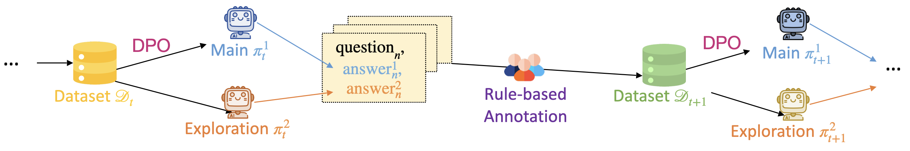

# Online-DPO-R1: Unlocking Effective Reasoning Without the PPO Overhead

<div align="center">
  <a href="https://efficient-unicorn-451.notion.site/Online-DPO-R1-Unlocking-Effective-Reasoning-Without-the-PPO-Overhead-1908b9a70e7b80c3bc83f4cf04b2f175">
    
  </a>
  <br>
  <a href="https://efficient-unicorn-451.notion.site/Online-DPO-R1-Unlocking-Effective-Reasoning-Without-the-PPO-Overhead-1908b9a70e7b80c3bc83f4cf04b2f175">Notion Page</a>
</div>


This is the repository for running the Iterative DPO with rule-based rewards. In every iteration, we sample responses from the model and label the rewards using the rule-based method. We then construct the preference pair based on the reward scores for DPO training. In our code, we perform iterative DPO starting with Qwen2.5-MATH-7B with prompts from Numina-Math. After the DPO training, our model achieves 26.7% on AIME24, 76.8% on MATH500, 62.5% on AME, 30.5% on Minerva-Math, and 37.9% on OlympiadBench, surpassing Llama-3.1-70B-Instruct and nearly on par with Eurus-2-7B-PRIME which adopts SFT and PPO training.


<div align="center">
  
  <p><em>Illustration of the iterative DPO pipeline. Here the exploration is implemented via best-of-n v.s. worst of n sampling. In other words, we sample n responses and use the response with the highest reward and lowest reward as a preference pair. For RAFT training, the pipeline is similar except that we only use the positive data for fine-tuning.</em></p>
</div>

## Models

We provide the model checkpoints from Huggingface:
- Qwen Warm-Up SFT: [RLHFlow/Qwen2.5-7B-SFT](https://huggingface.co/RLHFlow/Qwen2.5-7B-SFT)
- Qwen-DPO-R1-Zero: [RLHFlow/Qwen2.5-7B-DPO-Zero](https://huggingface.co/RLHFlow/Qwen2.5-7B-DPO-Zero)
- Qwen-DPO-R1: [RLHFlow/Qwen2.5-7B-DPO](https://huggingface.co/RLHFlow/Qwen2.5-7B-DPO)
- Qwen-RAFT-R1-Zero: [RLHFlow/Qwen2.5-7B-RAFT-Zero](https://huggingface.co/RLHFlow/Qwen2.5-7B-RAFT-Zero)
- Qwen-PPO-R1-Zero:[RLHFlow/Qwen2.5-7B-PPO-Zero](https://huggingface.co/RLHFlow/Qwen2.5-7B-PPO-Zero)

## Introduction

Inspired by the success of Deepseek-R1-Zero and several replications of PPO training which achieve superior performance on mathematical reasoning and demonstrate the “Aha moment” during RL training, we are curious about alternative algorithms in RL in this scenario. In this project, we implement rule-based RL from Qwen2.5-MATH-7B-base using iterative DPO and rejection sampling (RAFT), which are efficient and easy to implement. We train the models using the prompt set from the MATH training set and Numina-Math, and evaluate the models on AIME24, AMC23, MATH500, Minerva Math, and OlympiadBench. After several iterations, our models achieve an overall accuracy of 50.0% for DPO after SFT warm-up, 47.0% for DPO starting from the Base Model, and 44.4% for RAFT, compared to 33.9% for the Base Model. We list the result as follows:

<div align="center">

|  | AIME24 | MATH500 | AMC | Minerva Math | OlympiadBench | Average |  
|:--------:|:--------:|:--------:|:--------:|:--------:|:--------:|:--------:|
| Base   | 23.3  |  65.4 | 47.5  |  9.9   |    23.4   | 33.9      |
| Qwen-Base + SFT Warm Up   | 20.0|	73.2|	62.5|	30.5|	35.6|	44.4 |    
| Llama-3.1-70B-Instruct   | 16.7	| 64.6	| 30.1 |	35.3 |	31.9 |	35.7 | 
| Eurus-2-7B-PRIME   | 26.7 |	79.2 |	57.8 |	38.6 | 	42.1| 	48.9 |
| Qwen-DPO-NLL-R1-Zero   |30.0|	74.4	|62.5|	26.1|	37.9|	46.2|
| Qwen-DPO-R1-Zero   | 26.7 |	76.8 |	62.5 |	30.9 |	37.9 |	47.0 | 
| Qwen-DPO-R1-MATH7500-Zero   |26.7 |	72.2 |	57.5 |	26.8 |	37.2 |	44.1 | 
| Qwen-RAFT-R1-Zero   | 20.0 |	77.6 |	55.0 |	30.5 |	38.7 |	44.4 |
| Qwen-DPO-R1   | 30.0 |	84.4 |	62.5 |	33.5 |	48.4 |	51.8 |
| Qwen-PPO-R1-MATH7500-Zero	| 33.3 |	77.2| 67.5|	33.8|	40.7|	50.5 |
| Qwen-PPO-R1-Zero |	43.3|	79.4|	62.5|	33.1|	40.7|	51.8|

</div>

Our key findings:
* DPO and RAFT significantly improve model performance while remaining efficient and easy to implement.
* Iterative DPO does NOT benefit from the additional Negative Log-Likelihood (NLL) loss.
* DPO with SFT warm-up contributes to the training and improves performance.
* Compared to the PPO algorithm (51.8%), DPO/RAFT achieves an inferior performance, showing that PPO is still one of the most effective RL algorithms in this context.
* SFT Warm-Up before DPO could improve the model performance (51.8%) and be competent with Qwen-PPO-R1-Zero.

## Requirements

We have two separate environments for running the Iterative DPO.

### Generation
```sh
conda create -n vllm python=3.10.9
conda activate vllm
pip install datasets

# The following code is tested for CUDA12.0-12.2, and CUDA12.6
# To develop llama-3, mistral, gemma-1, 1.1, 2, deepseek you can consider the following vllm version
pip install vllm==0.5.4

pip install accelerate==0.33.0
pip install deepspeed==0.14.5
pip install transformers==4.48.1
pip install numpy==1.26.4 #Note that the numpy version should be `numpy<2.0`.  `Numpy 2.0` will encounter unexpected issues!!!

pip install antlr4-python3-runtime==4.7.2
pip install sympy==1.12
pip install latex2sympy2==1.9.1
pip install word2number==1.1
```

### Training
```sh
conda create -n rlhflow python=3.10.9
conda activate rlhflow

git clone https://github.com/huggingface/alignment-handbook.git
cd ./alignment-handbook/
git checkout 27f7dbf00663dab66ad7334afb7a1311fa251f41
pip3 install torch==2.1.2 torchvision torchaudio
python -m pip install .
pip install flash-attn==2.6.3
pip install accelerate==0.33.0
pip install huggingface-hub==0.24.7

pip install transformers==4.42.2
pip install peft==0.7.1  #We do not use peft, but some versions would cause errors.
pip install deepspeed==0.15.4
pip install trl==0.9.6
pip install wandb
```

## Running Online-DPO with numina prompt set:

```
bash run_iter_dpo.sh
```
## Evaluation

We provide the evaluation scripts for all the benchmarks we use, including **AIME24**, **AMC23**, **MATH500**, **OlympiadBench**, and **Minerva_Math**. Please go to ```eval_math``` folder for the detailed instructions.

## Citation

The authors would like to thank the great open-source communities, including the developers of vLLM, VeRL, OpenRLHF, Qwen, and Axolotl for sharing their models, codes, and training recipes. We also thank the developers of DeepSeek-R1 for open-sourcing their state-of-the-art models, and innovative training methodologies.  

If you find this blog our our codebase useful, it would be highly appreciated if you could consider citing our work by:

```bibtex
@misc{zhang2025dpor1,
  title={Online-DPO-R1: Unlocking Effective Reasoning Without the PPO Overhead},
  author={Hanning Zhang, Jiarui Yao, Chenlu Ye, Wei Xiong, Tong Zhang},
  year={2025},
  howpublished={\url{https://efficient-unicorn-451.notion.site/Online-DPO-R1-Unlocking-Effective-Reasoning-Without-the-PPO-Overhead-1908b9a70e7b80c3bc83f4cf04b2f175?pvs=4}},
  note={Notion Blog}
}
